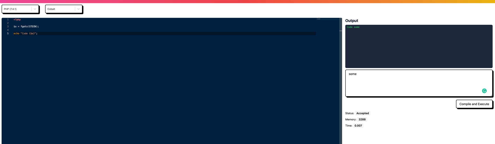

# React Code Editor

This project was built with [free dev code camp tutorial](https://www.freecodecamp.org/news/how-to-build-react-based-code-editor/).

## Roadmap

- [ ] Extract API calls to hooks (maybe)
- [ ] Add global state management
- [ ] Add default code for each language
- [ ] Better compilation error handling (for example PHP)
- [ ] Hint for keyboard shortcut for compilation (Ctrl + Enter)
- [ ] Add tests

## Deployment on GH pages

[Deployment](https://vladislavs-poznaks.github.io/react-code-editor/)
